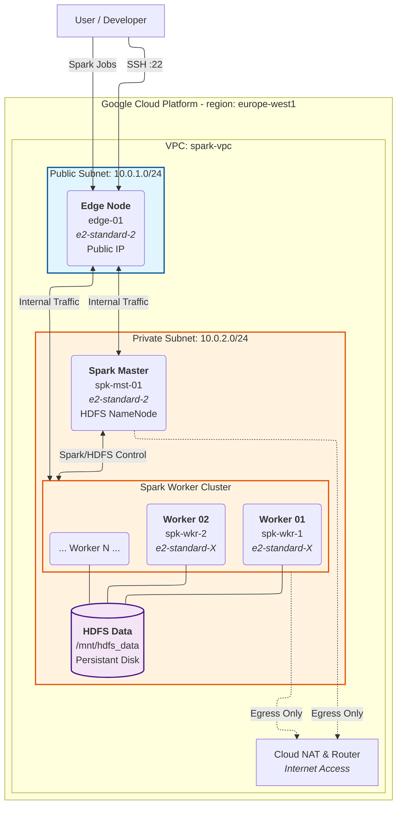

# ENSEEIHT GCP Spark Cluster Project
 
This repository contains the source code for the **ENSEEIHT GCP Spark Cluster Project**, an engineering initiative to fully automate the deployment of an **Apache Spark** cluster on **Google Cloud Platform (GCP)**.

The project uses industry-standard **Infrastructure-as-Code (IaC)** tools to create a repeatable, secure, and distributed Big Data environment.

## 🚀 Project Overview

* **Infrastructure:** Provisioned by **Terraform** (VMs, VPC, Firewalls, IAM).
* **Configuration:** Managed by **Ansible** (Java, Hadoop HDFS, Spark, System Tuning).
* **Automation:** Orchestrated via **GitHub Actions** (CI/CD Pipelines).
* **Security:** Uses a "Zero Trust" network model with private subnets and SSH bastion jumping.

---

## 🏗 Architecture

The cluster implements a secure 3-tier architecture within a custom Virtual Private Cloud (VPC):

| Node Type | Role | Network Zone | Specs (Standard Tier) |
| --- | --- | --- | --- |
| **Edge Node** | Bastion & Job Gateway | **Public Subnet** | `e2-medium` |
| **Spark Master** | Cluster Coordinator | **Private Subnet** | `e2-standard-2` |
| **Spark Worker** | Data Processing & HDFS | **Private Subnet** | `e2-standard-2` + 50GB Disk |

**Key Features:**

* **Isolation:** Worker nodes have **no public Internet access**.
* **Dynamic Inventory:** Ansible automatically discovers nodes via GCP API labels, eliminating static host files.
* **Persistent Storage:** HDFS is backed by dedicated persistent disks formatted as `ext4`.


---

## 🛠 Prerequisites

Before running the automation locally, ensure you have the following installed:

* **[Google Cloud SDK](https://cloud.google.com/sdk/docs/install)**
* **[Terraform](https://developer.hashicorp.com/terraform/install)** (v1.6+)
* **[Python 3.10+](https://www.python.org/downloads/)**
* **Ansible** (via `pip install ansible requests google-auth`)

You will also need a **GCP Billing Account** and SSH keys generated for the project.

---

## ⚡ Quick Start

### 1. Initialize Infrastructure

The infrastructure is typically deployed via CI/CD, but you can initialize it locally for development:

```bash
# Login to GCP
gcloud auth application-default login

# Initialize Terraform
cd terraform
terraform init

# Plan & Apply
terraform plan -out=tfplan
terraform apply tfplan

```

*[See: Infrastructure Documentation](https://www.google.com/search?q=https://github.com/Krruddy/ENSEEIHT-GCP-Spark-Cluster-Project/wiki/Infrastructure-(Terraform))*

### 2. Configure Cluster

Once the VMs are up, configure the software stack using Ansible:

```bash
# Run the main playbook
cd ansible
ansible-playbook site.yml

```

*[See: Ansible Documentation](https://www.google.com/search?q=https://github.com/Krruddy/ENSEEIHT-GCP-Spark-Cluster-Project/wiki/Configuration-(Ansible))*

---

## 🏃 Usage: Running Spark Jobs

Since the cluster is isolated, you cannot SSH directly into workers. We use operational playbooks to "stage" artifacts and retrieve results.

### 1. Workflow

1. Place your Python scripts in `spark/scripts/`
2. Place your input data in `spark/data/`
3. Deploy them to the Edge node:
```bash
ansible-playbook ansible/site.yml --tags "spark_artifacts"

```


### 2. Execution

Run a job and fetch the results back to your local machine:

```bash
ansible-playbook ansible/run_spark_job.yml \
  -e "job_name=test.py" \
  -e "data_name=lorem_ipsum.txt" \
  -e "output_name=experiment_01"

```

*Results will be downloaded to `spark/output/` as a `.tar.gz` archive.*

---

## 🔄 CI/CD Pipelines

This project uses **Workload Identity Federation (WIF)** to authenticate GitHub Actions with GCP without storing long-lived JSON keys.

* **Deploy Infrastructure:** Triggers on push to `main`.
* **Configure Spark:** Runs automatically after infrastructure deployment.
* **Destroy Infrastructure:** Manual trigger to save costs.

---

## 📚 Documentation

Detailed documentation is available in the **[Project Wiki](https://www.google.com/search?q=https://github.com/Krruddy/ENSEEIHT-GCP-Spark-Cluster-Project/wiki)**:
